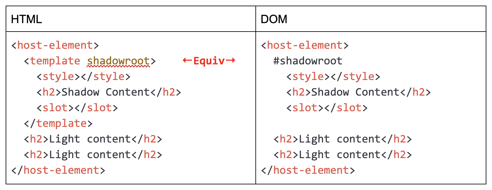
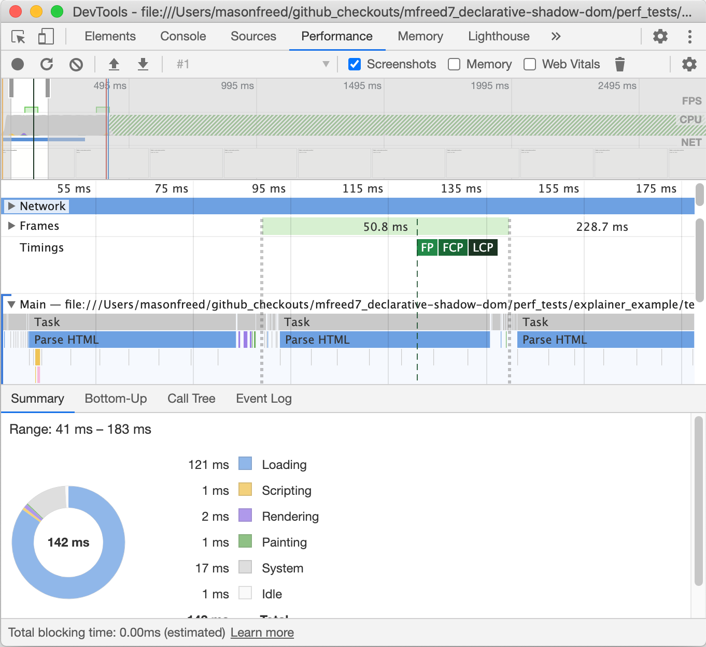
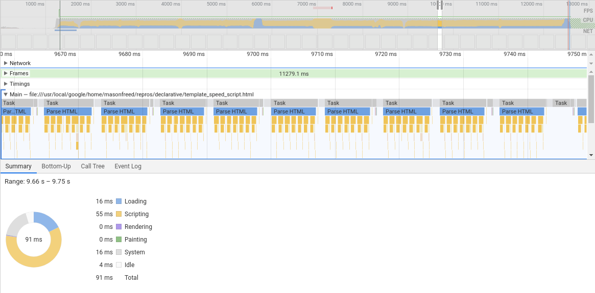
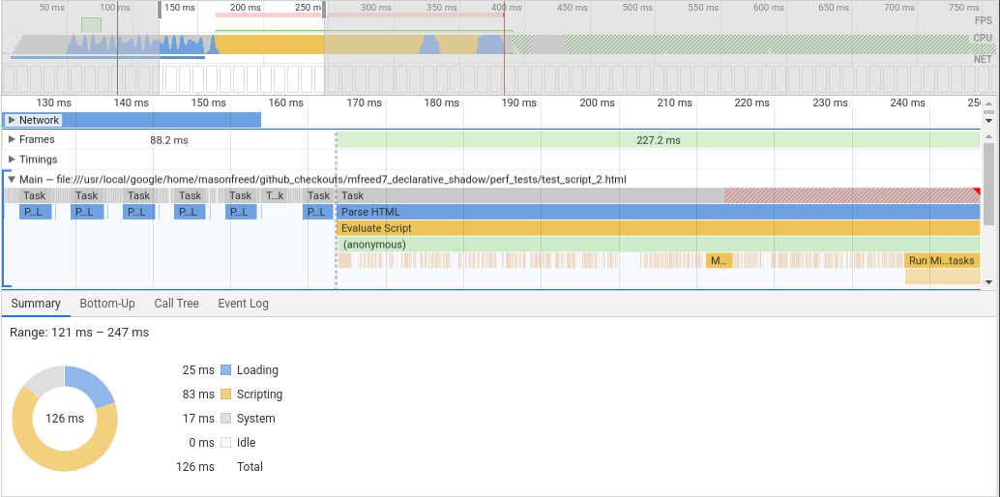

# Declarative Shadow DOM

Author: Mason Freed

Last Update: November 24, 2020

**Note:** There is also a [blog post](https://web.dev/declarative-shadow-dom/) that describes this set of features.

<!-- START doctoc generated TOC please keep comment here to allow auto update -->
<!-- DON'T EDIT THIS SECTION, INSTEAD RE-RUN doctoc TO UPDATE -->
# Contents

- [Motivation](#motivation)
- [Proposed Solution](#proposed-solution)
  - [Syntax](#syntax)
  - [Behavior](#behavior)
  - [Serialization](#serialization)
    - [Closed shadow roots](#closed-shadow-roots)
    - [Additional arguments for attachShadow](#additional-arguments-for-attachshadow)
- [Other Considerations](#other-considerations)
  - [Existing declarative shadow roots](#existing-declarative-shadow-roots)
  - [Ordinary templates containing declarative Shadow DOM](#ordinary-templates-containing-declarative-shadow-dom)
  - [Root element is `<template shadowroot>`](#root-element-is-template-shadowroot)
  - [Templates containing root-level declarative shadow roots](#templates-containing-root-level-declarative-shadow-roots)
  - [Other unanswered questions](#other-unanswered-questions)
- [What does declarative Shadow DOM mean?](#what-does-declarative-shadow-dom-mean)
- [Alternatives Considered](#alternatives-considered)
  - [Syntax: `<template shadowroot=open>` vs. `<shadowroot>`](#syntax-template-shadowrootopen-vs-shadowroot)
  - [Syntax: Attributes directly on elements](#syntax-attributes-directly-on-elements)
- [Performance](#performance)
  - [Template-based declarative Shadow DOM](#template-based-declarative-shadow-dom)
  - [Baseline #1 - inline script-based shadow root attachment](#baseline-1---inline-script-based-shadow-root-attachment)
  - [Baseline #2 - single script-based shadow root attachment](#baseline-2---single-script-based-shadow-root-attachment)
  - [Results](#results)
- [Feature Detection and Polyfilling](#feature-detection-and-polyfilling)
- [Example Custom Element](#example-custom-element)
- [Other Details & Questions](#other-details--questions)
- [Prior Discussion at Tokyo F2F](#prior-discussion-at-tokyo-f2f)
- [Security and Privacy Considerations](#security-and-privacy-considerations)
  - [Potential HTML sanitizer bypass](#potential-html-sanitizer-bypass)
  - [Mitigation](#mitigation)
- [References](#references)
  - [Helpful links](#helpful-links)

<!-- END doctoc generated TOC please keep comment here to allow auto update -->


# <a name="motivation"></a> Motivation

Server-Side Rendering (SSR) is an important requirement for many sites, which **precludes** any Javascript execution for getting the first pixels on the screen. The rationale given for this no-JS constraint typically includes:

*   Some search crawlers do not execute JS code before scraping page content, so for SEO, site owners require no-JS for indexable content.
*   The primary goal of SSR is to get rendered content in front of the user as fast as possible, prior to enabling interactivity. Eliminating all JS (including small inline scripts) from SSR content is seen as a hard requirement.
*   Some users run with no-JS settings/environments (e.g. users running JS script blockers), and supporting these users with at least basic content is required.

For the reasons above, the current imperative-only API for Shadow DOM is not compatible with SSR. In order to support Shadow DOM in SSR environments, a declarative Shadow DOM API is required.

Another related requirement for SSR solutions is that they support “isomorphic” code: the code running on the server (to build the SSR content) should be the same as the code running on the client. For Web Components, that boils down to the need for a DOM tree that can be serialized on the server and deserialized on the client back into the same tree, including #shadowroot nodes.

In addition to the SSR motivations given above, another commonly-cited motivation is ergonomics. One of the primary “features” of Shadow DOM is style encapsulation. The CSS developers who are involved with styling components are typically more comfortable with HTML/CSS than they are with JS, and usually prefer to be able to achieve their styling objectives without resorting to JS. Some design systems even limit or prohibit the use of JS for styling. Offering CSS developers an ergonomic declarative way to utilize Shadow DOM without requiring any JS would therefore allow such developers to benefit from the style scoping feature of Shadow DOM.

Finally, a distinct but related problem that this proposal could solve is the current inability to completely serialize DOM that contains shadow roots. Calling `node.innerHTML` on a node that contains a `#shadowroot` does not return the `#shadowroot` or any of its children. With this proposal, it is possible to provide that missing feature.

Declarative Shadow DOM is an often-requested feature from developers. For example, see [these](https://github.com/whatwg/dom/issues/510#issuecomment-371211493) [comments](https://github.com/whatwg/dom/issues/510#issuecomment-370988065) [on](https://github.com/whatwg/dom/issues/510#issuecomment-371214119) [the](https://github.com/whatwg/dom/issues/510#issuecomment-371513483) [resolution](https://github.com/whatwg/dom/issues/510#issuecomment-371670135) [thread](https://github.com/whatwg/dom/issues/510#issuecomment-371566754). The prior attempts to standardize a declarative Shadow DOM syntax have all been [rejected](#tokyof2f) for a variety of reasons. This proposal attempts to resolve prior objections and get to a solution that all implementers can agree upon.


# Proposed Solution


## Syntax

The proposed solution re-uses the existing `<template>` element with a new “shadowroot” attribute to declare the shadow content and trigger the attachment of a shadow root:

```html
<host-element>
    <template shadowroot="open">
        <style>shadow styles</style>
        <h2>Shadow Content</h2>
        <slot></slot>
    </template>
    <h2>Light content</h2>
</host-element>
```


## <a name="behavior"></a> Behavior

With the above markup, the HTML parser will perform these steps:


1. Upon encountering the opening `<template shadowroot="open">` tag, the parser switches to the [“in template”](https://html.spec.whatwg.org/multipage/parsing.html#parsing-main-intemplate) insertion mode, just as with a normal `<template>` tag. All behaviors already associated with “in template” mode are followed at this point.
2. Subsequent child content is parsed using the [existing rules](https://html.spec.whatwg.org/multipage/scripting.html#template-contents) for “in template” insertion mode: child content is parsed into a new DocumentFragment without a browsing context.
3. Upon parsing the closing `</template>` tag (or when the `<template>` node is popped off the [stack of open elements](https://html.spec.whatwg.org/#stack-of-open-elements) in the case of mis-nested tags):
    1. The [existing procedure](https://html.spec.whatwg.org/multipage/parsing.html#parsing-main-inhead) for the closing “template” tag is performed.
    2. Let "the template element" equal the `<template>` element popped from the stack of open elements in the previous step.
    3. Let “shadowroot” equal the value of an attribute in "the template element"'s start tag token with the name "shadowroot". (Note: the check is made for the attribute value in the **start tag token**, similar to how [HTML integration point](https://html.spec.whatwg.org/multipage/parsing.html#tree-construction) is defined. This is a parser-only feature.)
    4. Let “delegates_focus" equal the value of an attribute in "the template element"'s start tag token with the name "shadowrootdelegatesfocus".
    5. If “shadowroot” **does not** contain a valid value (“open” or “closed”), then these steps end here. This is not a declarative shadow root. (See [this discussion](#missingmode).)
    6. Let "shadowhost" equal the parent node of "the template element". (Note: the shadow root will be attached to the parent of the `<template>` node when the `</template>` closing tag is encountered. If script has moved that node, the shadow root will be attached to the new/current location.)
    7. If "shadowhost" is null, or is not a [valid shadow host element](https://dom.spec.whatwg.org/#dom-element-attachshadow), stop here - no shadow root will be attached in this case.
    8. A shadow root is attached to "shadowhost", with a mode equal to “shadowroot” (open or closed), and delegatesFocus equal to "delegates_focus".
    9. The content of "the template element"'s DocumentFragment is **moved** into the newly-created shadow root.
    10. "The template element" (now empty) is [removed](https://dom.spec.whatwg.org/#dom-childnode-remove) from the document. (See [this discussion](#keepthenode).)

One additional change is made to the specification for `HTMLTemplateElement`: the `.content` property will return `null` for the `<template shadowroot="open|closed">` element created during parsing. This will prevent scripts and `MutationObserver`s from gaining access to the internals of the shadow root while parsing is taking place. Since the `<template>` element is only present during parsing, and is removed in step 10 above, this simply prohibits access during parsing.

With the behavior and example code above, the resulting DOM tree will be:


```html
<host-element>
  #shadow-root (open)
    <style>shadow styles</style>
    <h2>Shadow Content</h2>
    <slot>
        ↳ <h2> reveal
    </slot>
  <h2>Light content</h2>
</host-element>
```


For comparison, the above code snippet and behavior results (under this proposal) in the same final DOM tree as the following snippet which uses inline `<script>` to attach the shadow:


```html
<host-element>
    <template>
        <style>shadow styles</style>
        <h2>Shadow Content</h2>
        <slot></slot>
    </template>
    <script>
      var template = document.currentScript.previousElementSibling;
      var shadowRoot = template.parentElement.attachShadow({mode:"open"});
      shadowRoot.appendChild(template.content);
      template.remove();
      document.currentScript.remove();
    </script>
    <h2>Light content</h2>
</host-element>
```


## Serialization

To provide maximum value, a DOM tree containing `#shadowroot`’s should also be able to be serialized using element.innerHTML. However, as the existing behavior is to **not** include the `#shadowroot` or any of its contents, simply adding this capability by default would pose a web compat problem. So instead, a new method will be added to Element called `getInnerHTML()`:

```javascript
const html = element.getInnerHTML({ includeShadowRoots: true });
```

When called with `includeShadowRoots: true` on nodes that contain Shadow Hosts, the returned HTML will include a `<template shadowroot>` tag containing the shadowroot contents for each such node.

As this is a new method, there are no compat problems to worry about. This method also allows future serialization options to be added, such as a method for serializing adoptedStylesheets found inside shadow roots.

### Closed shadow roots

To allow serialization of closed shadow roots, an additional option will be added:

```javascript
const html = element.getInnerHTML({ includeShadowRoots: true, closedRoots: [shadowRoot1,shadowRoot2,...] });
```

Using this syntax, if any of the `closedRoots` shadow roots are encountered during serialization, they will be serialized regardless of whether they are open or closed. Closed shadow roots will be serialized using `<template shadowroot="closed">`.


### Additional arguments for attachShadow

Because the `attachShadow()` function has one other argument, `delegates_focus`, and potentially more in the future, there needs to be a way to specify these parameters in the declarative case. This is important not only for developer flexibility, but also so that the `getInnerHTML()` has a way to completely represent all possible shadow roots found in content. To achieve this, additional attributes will be added to the `<template shadowroot>` tag:

```html
<template shadowroot="open" shadowrootdelegatesfocus>
```

Here, the presence of the `shadowrootdelegatesfocus` boolean attribute will cause the shadow root to be attached as if this imperative call were used:

```javascript
attachShadow({ mode = "open", delegatesFocus = true });
````

Additional parameters added to attachShadow in the future could naturally be added as attributes to the declarative `<template shadowroot>` form.


# Other Considerations

With the behavior described above, a number of questions and corner cases arise:

## Existing declarative shadow roots

Because existing components might exist that do not anticipate the existence of a declaratively-created shadowroot, these components might break if they assume `this.attachShadow()` will never throw and will always return an empty shadow root. To accomodate these components, the following changes will be made:

1. If `attachShadow()` is called on a node that already contains a **declaratively-created** shadow root, the existing contents of that shadow root will be removed, and the (now empty) shadow root will be returned by `attachShadow()`. Note that no behavior changes will be made for **imperatively**-created shadow roots. An existing imperatively-created shadow root will cause any subsequent call to `attachShadow()` to throw an exception, as it does today.

2. (Discussed in a separate [issue](https://github.com/w3c/webcomponents/issues/871)) An accessor will be added to `ElementInternals` to provide "declarative Shadow DOM-aware" components access to existing shadow roots, including "closed" shadow roots. The `ElementInternals.shadowRoot` accessor will return any existing `#shadowroot` so that its content can be potentially re-used and connected.

**Note** that because step #1 above will be the defined behavior for the "attach a shadow root" DOM algorithm, it will also be used when attaching a declarative shadow root. This means that if **multiple** declarative shadow roots are included within a **single** shadow host element, only the **last** declarative shadow root will remain, and all prior shadow root contents will be removed. So:

```html
<div>
  <template shadowroot="open">
    <h1>This h1 tag will be removed, but this shadow root will remain.</h1>
  </template> 
  <template shadowroot="closed">
    <h1>This is the final, *open* shadow root content.</h1>
  </template> 
</div>
```

As noted, only the contents of the second shadow root will remain. And because the original (first) declarative shadow root is kept, and only its contents are removed, the final shadow root in this example will have "open" mode.

The best practice will be to only include a single declarative `<template shadowroot>` element within each host element.


## Ordinary templates containing declarative Shadow DOM

Consider this code:

```html
<template id=ordinary>
  <div>
    <template shadowroot=open>
      <slot></slot>
    </template>
  </div>
</template>
```

In this case, the "ordinary" template contains a div, which in turn contains a declarative shadow root. When this is parsed, the contents of the
template will be parsed into a separate content document, and as the declarative `<template shadowroot>` node is encountered and parsed, a shadow
root will be attached to `<div>`. Therefore, this template content document will contain a declarative `#shadowroot`. When cloned, the expectation would be
that the resulting cloned content should also have  declarative `#shadowroot`:


```javascript
container.appendChild(ordinary.content.cloneNode(true));
```

...should result in the following DOM:
```html
<div id=container>
  <div>
    #shadowroot
      <slot></slot>
  </div>
</div>
```

In order to achieve that, the WhatWG DOM spec for [cloning a node](https://dom.spec.whatwg.org/#concept-node-clone) will need to be modified.
In that algorithm, when a declarative shadow root is encountered on the source node, a shadow root will need to be attached to the copy, and
the contents of the shadow root also cloned to the copy's shadow root.

## Root element is `<template shadowroot>`

In this case:

 ```javascript
host.setInnerHTML('<template shadowroot=open></template>', ...)
```

 it would be a bit odd/confusing if this attached a shadow root to the `<host>` element. To avoid confusion, this will just result in a warning, and a “normal” template inside `<host>`.


## Templates containing root-level declarative shadow roots

 ```html
 <template id=my_template>
     <template shadowroot=open></template>
 </template>
 <div id=host></div>
 <script>
     host.appendChild(my_template.content.cloneNode(true));
 </script>
```

 In this case, similar to the prior example, it would be odd/confusing to attach a `#shadowroot` to `<div id=host>`. Here again, to avoid confusion, this will just issue a warning, and place a “normal” template inside `<host>`.


## Other unanswered questions 
1. How should `adoptedStylesheets` on `#shadowroot` nodes be handled? On the parser side, should there be a way to "point to" a stylesheet that gets automatically adopted within the declarative `#shadowroot`? On the serialization side, should the existing contents of `adoptedStylesheets` be automatically serialized into new `<style>` nodes? This could potentially be controlled by a new `convertAdoptedStylesheetsToInlineStyles` argument to `getInnerHTML()`.

2. What about CSS custom states and AOM IDL attributes? These can't yet be represented declaratively, so there is no way to serialize them in `getInnerHTML()`. This means that custom elements must re-set these values upon construction. I don't see a better solution than this.


# <a name="what-does-declarative-mean"></a> What does declarative Shadow DOM mean?

It is important to note that a `#shadowroot` within a DOM tree is very special. It is not a node within the normal DOM tree. It is not part of `node.children` or `node.parent` for any node in the tree. It is, in this way, very unlike most other “normal” nodes. As such, one should expect the declarative HTML representation of `#shadowroot` to also have some special properties, and to behave differently from other HTML tags.

For example, one of the “normal” behaviors of HTML tags is that they don’t “disappear”. If “`<element>`” appears in the HTML, then the corresponding DOM tree contains an `<element>` node in the tree. However, for any direct declarative representation of `#shadowroot`, the “`<template shadowroot>`” tag will be present in the HTML, but there will be a `#shadowroot` ***in its place*** in the DOM. And to have a proper correspondence between HTML and DOM in this case, there should **not** be a `<template shadowroot>` element **also** in the DOM tree. If there were, repeatedly calling `host_element.outerHTML = host_element.outerHTML` would add duplicate `<template shadowroot>` elements to the DOM tree, and would result in errors due to the attempt to attach multiple shadow roots.



Note the symmetry in the above HTML/DOM comparison. The “`<template shadowroot>`” HTML on the left exactly corresponds to the `#shadowroot` in the DOM tree on the right.

One element that is somewhat similar in these ways to the `#shadowroot` is a “normal” `<template>` element. While a “`<template>`" tag found in HTML parses into a `<template>` element in the DOM tree, any content within the `<template>` tag is parsed into a separate `#document-fragment`. That content does **not** become child nodes of the `<template>` element, even though the HTML markup appears to place it there as children:


# Alternatives Considered


## Syntax: `<template shadowroot=open>` vs. `<shadowroot>`

It would be more ergonomic to define the declarative shadow root using a **new** `<shadowroot>` tag, rather than re-using the `<template> `tag with a new attribute. However, this approach has two major disadvantages:


1. Before the new `<shadowroot>` tag is implemented and understood by all rendering engines, there could be serious compat problems. Consider what would happen in this case, if `<shadowroot>` is not natively understood, and is instead parsed into an HTMLElement:

 ```html
<shadowroot>
    <style>
      Scoped styles here
    </style>
    <script>
       const myShadowRoot = document.currentScript.getRootNode();
    </script>
</shadowroot>
```

 In this case, the intention is for the `<style>` block to be scoped to the shadow root, and the `<script>` to execute once the shadow root has been attached. However, since `<shadowroot>` is parsed to a plain HTMLElement, the `<style>` styles will leak out and apply to the entire page, and within the `<script>`, myShadowRoot will actually point to the owner document object. Both would seem to be very bad.

 In contrast, the chosen `<template>` approach is safe from both issues, since it will be parsed as an inert DocumentFragment, which simply doesn’t get converted into a shadow root (before this feature is implemented). This situation is much easier to feature-detect and code around.

2. Implementation of a new `<shadowroot>` element, with most of the same parser semantics as `<template>`, is a significant undertaking. The implementation of `<template>` took many years, and suffered through many [security bugs](https://github.com/whatwg/dom/issues/510#issuecomment-372224104), before being stabilized in all renderers. And while the `<shadowroot>` element could likely “follow the pattern” set by the `<template>` implementation, it would still be a significant undertaking.


## <a name="missingmode"></a> Syntax: `<template shadowroot=open>` vs `<template shadowroot>`

It would be more ergonomic to allow `shadowroot` to function as a boolean attribute, without needing to declare the shadow root open or closed. However, deferring to the previously-agreed-upon imperative behavior, which requires the mode to be defined (open vs closed), it seems better to stick with that behavior in the declarative version. Therefore, it is required that `shadowroot` be equal to either `"open"` or `"closed"` - anything else results in the element being parsed as a normal `<template>` element.


## Timing: Attach the shadow on opening or closing `<template>` tag?

If the shadow root were attached upon encountering the opening `<template>` tag, there would seem to be several **advantages**:


1. This approach would likely be more compatible with streaming. When the shadow root is attached only on the **closing** `</template>` tag, nothing will be rendered until that point. If the page consists of a large, nested set of web components, then nothing will be rendered until the parser encounters the final closing tag of the outermost component. This problem isn’t as bad if the page is built as a light dom document containing many small web-components-based widgets.
2. This solution would likely be slightly more performant. By directly parsing the `<template>` contents into the shadow root, there would be no need to move the template contents into the shadow root document.

However, the major downside to this approach is that the implementation complexity would likely be significantly higher. The existing `<template>` code would need to be carefully modified to understand the differences between parsing into an inert `<template>` DocumentFragment and parsing into an active `#shadowroot`. Additionally, because the shadow root document would be “live” in this case, contained scripts could execute. This would require more care (and code) to deal with the corner cases that might arise in this situation. It is possible that these corner cases are the same ones encountered while implementing `<template>`, and therefore the `<template shadowroot>` implementation could “copy” the details from `<template>`. However, this would still require significantly more effort.


## <a name="keepthenode"></a> Keep the `<template shadowroot>` node around?

The current proposal removes the `<template shadowroot>` node after performing the `attachShadow()` and moving the content out of the `<template>` and into the `#shadowroot`. Alternatively, that `<template>` node could be left in the document as an empty inert node, similar to how existing `<template>` elements are left in the DOM tree, albeit without any children. The downsides of this approach are:


1. The ergonomics would be a bit worse, as there would be a leftover copy of the template that would be encountered upon traversing the tree. This would lead to confusion among both developers (who would see both DocumentFragments in the devtools Elements pane) and scripts (which would now iterate over both sets of trees). Additionally, the leftover `<template>` node would always get slotted into the unnamed `<slot>`.
2. The memory consumption and overhead would be increased, due to the extra `<template shadowroot>` node left in the tree. Additionally, the slotting algorithm would also need to do extra work to slot in the leftover `<template shadowroot>` element into unnamed slots within the shadow root.

The advantage of this approach would be that it avoids the abnormal behavior of a "self-removing" element. There are no current examples in the web platform of elements that remove themselves when parsed. (There is one historical example, `<isindex>`, but that has since been removed.) This advantage seems to be mostly about theoretical purity at this point. So unless there turns out to be negative web developer impact from introducing this new behavior, the above downsides would seem to outweigh this advantage. Also, arguably (see [this section](#what-does-declarative-mean)), the `<template shadowroot>` under this proposal is not “removed”, but rather transformed into its equivalent `#shadowroot` in the final DOM tree.

## Instead of inline contents, use an idref to an existing template

It might be argued that more compact HTML could be generated if declarative Shadow DOM was defined something like this:


```html
<template id=my_shadow_content>
  <style>Component styles</style>
  <slot></slot>
</template>

<custom-element shadowcontent=my_shadow_content>
  <div>Light dom content</div>
</custom-element>
```


This is similar to other efforts to [do something similar](https://github.com/whatwg/html/issues/4925#issuecomment-563434122) for ARIA “labelled by” attributes. This solution would also have the added benefit of being able to embed styles (the “Component Styles” in the example above) in one place, which then get shared to all custom elements that use the same template.

However, a number of technical and syntactic questions arise:


*   What if the `<template>` is defined after the `<custom-element>`, instead of before it, as written above? The shadow attachment would need to be deferred in that case until the template was found.
*   What if the `<template>` resides outside the current document/shadow root? Should the idref be able to pierce shadow bounds? Upwards (to parent documents) and downwards (to contained shadow boundaries)?
*   How often is this really helpful? With non-trivial custom elements, even if many instances of the same component are used on a page, the likelihood is small that they all contain the same data, and therefore the same default SSR state. Therefore, the benefit/savings might be small in practice.
*   If the goal of this approach is to reduce the size of the delivered HTML resource for SSR applications, and if many of the same component (with identical data) really are being used on the same page, then the gzip compression algorithm will likely be able to almost-perfectly compress the duplicated component HTML chunks, so long as they aren’t separated too far within the HTML stream. So again, the benefit/savings might be small in practice.


## Syntax: Attributes directly on elements

Instead of a dedicated `<template shadowroot>` node that denotes the shadow root contents directly, an alternative would be to mark up the shadow host (any element that supports shadow root attachment) with a “shadow-host” attribute, and then mark up any direct child elements that should reside within the shadow root with another attribute, “shadow-child”:


```html
<host-element shadow-host="open">
  <div shadow-child>..</div>
  <div></div>
  <span shadow-child>..</span>
</host-element>
```


This approach might be perceived to be less confusing, since it avoids an HTML tag that doesn’t end up in the final tree, like `<template shadowroot>`. One downside is that it doesn't support text or comment nodes within the shadow root, and _requires_ that the nodes are removed from their textual position. Also, this approach might end up actually being **more** confusing to developers than a single `<template shadowroot>` element, which clearly divides `#shadowroot` content from light DOM content.


# Performance

As a very simple test, I naively implemented the proposed declarative shadow attachment algorithm, mostly as [written above](#behavior) with all operations occurring at the closing `</template>` tag. This has been built into Chrome as of version 82.0.4060.0, and must be tested with the `--enable-blink-features=DeclarativeShadowDOM` flag provided on the command line. I tested this locally on Chrome v82.0.4068.4 on Linux, on a fairly high-powered Lenovo P920 workstation. I used [tachometer](https://www.npmjs.com/package/tachometer) for all testing. I provided three different inputs, all loaded from local files. Each input consisted of 10,000 copies of the same code snippet, one of which used declarative Shadow DOM, and the other two as baselines. See below for descriptions of each type of snippet. Care was taken to eliminate forced style/layout, by wrapping the set of copies inside a `<div>` with `display:none` and `contain:strict`. All code can be found [here](perf_tests/explainer_example).


## Template-based declarative Shadow DOM

The declarative Shadow DOM snippet uses the `<template shadowroot>` element as described in this document:


```html
<div>
    <template shadowroot=open>
        <slot></slot>
    </template>
    <span>${copy_num}</span>
</div>
```


## Baseline #1 - inline script-based shadow root attachment

The first baseilne snippet replicates a proposed alternative to native declarative Shadow DOM, which uses an inline script placed just after each `<template>` to attach the shadow root and move the template contents into the root. For completeness, this snippet also removes the `<template>` element and the inline `<script>` node, so that the resulting tree is identical to the declarative output. I found that the results did not change appreciably if both the `<template>` and `<script>` were left in the document instead.

This approach is the most straightforward replica of a declarative shadow dom solution - the shadow root is attached and populated immediately after it is parsed, so that content streaming is possible.


```html
<div>
    <template>
        <slot></slot>
    </template>
    <script>
        var template = document.currentScript.previousElementSibling;
        var shadowRoot = template.parentElement.attachShadow({mode: "open"});
        shadowRoot.appendChild(template.content);
        // These two lines didn't affect performance appreciably:
        template.remove();
        document.currentScript.remove();
    </script>
    <span>${copy_num}</span>
</div>
```


## Baseline #2 - single script-based shadow root attachment

The second baseline snippet uses a single script at the end of the HTML that loops over all templates to attach the shadow roots and move the template contents into each root. This snippet also removes the `<template>` elements and the final `<script>` node.

This approach is optimized for speed - the entire page is parsed first, and then one script does all of the shadow root attachment and population. The advantage here is that the parser is not blocked for script on each shadow root. The major disadvantage is that streaming is no longer possible. The entire page will consist of inert `<template>` elements that do not render, until the final script loops through and "converts" them into shadow roots. This will likely delay first paint.


```html
<!-- Repeated chunk: -->
<div>
    <template class=shadowroot>
        <slot></slot>
    </template>
    <span>${copy_num}</span>
</div>

...
<!-- Single script at the end: -->
<script>
    const shadowroots = document.querySelectorAll('.shadowroot');
    for (var i=0; i<shadowroots.length; ++i) {
        const shadowRoot = shadowroots[i].parentElement.attachShadow({mode: "open"});
        shadowRoot.appendChild(shadowroots[i].content);
        shadowroots[i].remove();
    }
    document.currentScript.remove();
</script>
```


## Results

The (very preliminary) results were:

|     Version | <none>      |
|-------------|-------------|
|     Browser | chrome<br>82.0.4068.4      |
| Sample size | 50          |


| Benchmark          | Bytes       |              Avg time |      vs Declarative |    vs Inline Script | vs Single Loop Script |
|:-------------------|------------:|----------------------:|--------------------:|--------------------:|----------------------:|
| Declarative        | 1034.63 KiB |   248.72ms - 254.60ms |    |          **faster**<br>79% - 79%<br>936.93ms - 951.87ms | **faster**<br>10% - 13%<br>29.32ms - 38.18ms |
| Inline Script      | 3720.18 KiB | 1189.19ms - 1202.93ms | **slower**<br>369% - 381%<br>936.93ms - 951.87ms |    | **slower**<br>314% - 324%<br>903.03ms - 918.28ms |
| Single Loop Script | 1044.74 KiB |   282.10ms - 288.72ms | **slower**<br>12% - 15%<br>29.32ms - 38.18ms | **faster**<br>76% - 76%<br>903.03ms - 918.28ms |   |


So the declarative snippet is **\~10% faster** than the single loop script, and almost **5 times faster** than the one-script-per-shadow-root approach. It is very important to emphasize that this is just a preliminary look into performance. Clearly the code snippets used are not optimized, and particularly in the case of the inline `<script>` snippets, these are two extremes between one script per shadow root and one script per page. However, it is interesting to look into a trace of the results (on similar time scales), to see where the extra time is being spent/saved for these naive examples:

**<span style="text-decoration:underline;">Declarative Shadow DOM trace</span>**

<table border=2><tr><td></td></tr></table>

**<span style="text-decoration:underline;">Inline Scripts trace</span>**

<table border=2><tr><td></td></tr></table>

**<span style="text-decoration:underline;">Single Loop Script trace</span>**

<table border=2><tr><td></td></tr></table>


In the script-based snippet, not only does the inline script cause a significant amount of time to be spent in the JS engine, but additionally, each inline script causes the parser to yield to run microtasks. Both of those significantly slow down rendering for the inline script example. The single loop script defers **all** script execution time until the end, so the parsing/loading is faster, but then more than half of the total time is spent at the end within the script loop. The declarative snippet continuously runs parsing, including attaching shadow roots, until the parser yields for other reasons. At that point, it spends almost half of its time firing slotchange events at microtask timing.


# Feature Detection and Polyfilling

To detect support for declarative Shadow DOM, something like this could be used:


```javascript
function supportsDeclarativeShadowDOM() {
  return HTMLTemplateElement.prototype.hasOwnProperty("shadowRoot");
}
```

Polyfilling is also relatively easy:

```javascript
document.querySelectorAll('template[shadowroot]').forEach(template => {
  const mode = template.getAttribute('shadowroot');
  const shadowRoot = template.parentNode.attachShadow({ mode });
  shadowRoot.appendChild(template.content);
  template.remove();
}
```

# Example Custom Element

To **make use of** declarative Shadow DOM, in the most typical use case of custom elements, something like this could be used (hat tip to @Rich-Harris for the [idea](https://github.com/whatwg/dom/issues/831#issuecomment-585372554)). This example can be seen live, [here](https://jsbin.com/qehoqej/2/edit?html,output).

```html
<my-clock>
    <template shadowroot=open>
        <!-- This is the SSR content -->
        <style> Clock styles here </style>
        <div>
          <span id=hour>12</span> : <span id=min>34</span> : <span id=sec>56</span>
        </div>
    </template>
</my-clock>
<script>
 customElements.define('my-clock', class extends HTMLElement {
    #internals = null;
    constructor() {
      super();
      this.#internals = this.attachInternals();
      if (!this.#internals.shadowRoot) {
        // If we don't have SSR content, build the shadow root
        this.attachShadow({mode: 'open'}).innerHTML = `
          <style> Clock styles here </style>
          <div>
            <span id=hour></span> : <span id=min></span> : <span id=sec></span>
          </div>
        `;
      }
      const shadow = this.#internals.shadowRoot;
      this.hours = shadow.querySelector('#hour');
      this.minutes = shadow.querySelector('#min');
      this.seconds = shadow.querySelector('#sec');
    }

    connectedCallback() {
      this.update();
      this.interval = setInterval(() => this.update(), 1000);
    }

    disconnectedCallback() {
      clearInterval(this.interval);
    }

    update() {
      const pad = v => {return String(v).padStart(2,'0')}
      const d = new Date();
      this.hours.textContent = pad(d.getHours());
      this.minutes.textContent = pad(d.getMinutes());
      this.seconds.textContent = pad(d.getSeconds());
    }
  });
</script>
```

Note that in the above code, the only thing added to support SSR is the `if (!this.#internals.shadowRoot)` block, which handles building the shadow root if none was already present from declarative content. This code assumes that any declarative SSR content always matches the hydrated content, as it does not include any code to diff the two. This proposal is for the declarative Shadow DOM primitive, and does not propose a particular way to handle SSR vs. CSR content matching.

# Other Details & Questions


*   Once the declarative shadow root has been parsed, it should behave exactly as if it were created using the existing imperative API. E.g. `host.shadowRoot` should return the shadow root, etc.
*   Invalid situations result in a "normal" `<template>`:
    *   If the “shadowroot” attribute is anything other than “open” or “closed”, then the element is parsed as a “normal” `<template>` element.
    *   If the parent element of the `<template shadowroot>` element already has a shadow root attached, an error will be fired at Window, and the content will be parsed as if it is within a normal `<template>` element.
    *   If the parent element of the `<template shadowroot>` element is not a [valid element](https://dom.spec.whatwg.org/#dom-element-attachshadow) to host a shadow root, then an error will be fired at Window, and the content will be parsed as if it is within a normal `<template>` element.
*   It is legal to nest a `<template shadowroot>` inside a “normal” `<template>`. In this case, the shadow root attachment [behavior](#behavior) occurs only when the “normal” template contents are cloned into the document, and not while parsing the (non-declarative shadow root) `<template>`.
*   The most straightforward way to share stylesheets across similar components would be to embed a `<link rel=stylesheet>` within the declarative shadow root:

 ```html
<host-element>
    <template shadowroot=open>
        <link rel=stylesheet href="component_styles.css">
        <slot></slot>
    </template>
    <h2>Light content</h2>
</host-element>
```

 With the snippet above, the browser will load and parse the component_styles.css stylesheet once, and will re-use it for each occurrence of this component. This will, of course, suffer from performance problems if there are many different component CSS stylesheet links on the page.

*   Why not wait for, or link this to, [declarative custom elements](https://github.com/w3c/webcomponents/blob/gh-pages/proposals/Declarative-Custom-Elements-Strawman.md)? At first blush, it would seem that these two proposals go together. However, the primary motivating use case for declarative **Shadow DOM** is SSR and No-JS. Custom element definitions need javascript to function; therefore, this is a different use case/proposal and the two should not be tied together. Of course, they should be interoperable. Additionally, there are several use cases for declarative Shadow DOM that do not need custom elements at all: scoped styling, for example.
*   Because `<template shadowroot>` is detected only upon parsing the opening tag, this declarative API cannot be used to create a shadowroot via JS. This is a **parser-only** API. E.g. doing this:

 ```javascript
 // This doesn't work:
 const shadowroot = document.createElement('template');
 shadowroot.setAttribute("shadowroot", "open");
 ```
  just results in a "normal" `<template>` being created. The entire [motivation](#motivation) for this feature is no-JS environments; therefore, to simplify the implementation, only **parser-generated** templates will create shadow roots, and adding the shadowroot attribute to a `<template>` after the fact will have no effect. To create a shadowroot using JS, the existing `element.attachShadow()` API should be used.


# <a name="tokyof2f"></a> Prior Discussion at Tokyo F2F

The last (major) discussion of declarative Shadow DOM occurred at the 2018 Tokyo Web Components Face-to-Face meeting. The resolution from that meeting was **not** to proceed with a declarative Shadow DOM feature. Here is the summary of [that resolution](https://github.com/whatwg/dom/issues/510#issuecomment-370980398):

> Tokyo F2F: The outcome was we will not move forward with this proposal. Overloading \<template\> tag with more functionality (like shadowroot attribute) may end up with lots of confusion for developers, especially given ongoing, not finalized progress with template instantiation. Specific new <shadowroot> tag would require new parser macro to wait for the end tag to attach shadow root and remove the node, that could introduce similar security problems during implementation as it did for template element.
>
> We need to make sure that before shadow root is attached its \<style\>s should not apply to the outer/host tree, scripts and custom elements should not have an access to the \<shadowroot\> ascendant node.
>
> I actually do not feel competent enough in the parser area to give a correct rationale why do we need that macro and wait for the end tag.
>
> @rniwa could you comment shortly why can't we attach shadow root to the parent and remove the element on start tag, then continue attaching descendants to the shadow root, or beside using the different name, use the mechanics of template element for parsing?
>
> Supporting non-scripting/scripting-forbidden environments is not sufficient motivation for implementing new features into the Platform for the Group. All other cases should be solvable by a library/custom element that implements declarative shadow dom. Therefore it's up to the user-land and frameworks to adopt such convention.

So the important points from the above summary resolution were:

*   Building a new `<shadowroot>` element would require **significant parser work**, with significant security issues, similar to what was [encountered](https://github.com/whatwg/dom/issues/510#issuecomment-372224104) while implementing `<template>`.
*   The stated use case of **“no-JS”** environments is **not a sufficient motivation** to implement this feature.
*   Re-using the `<template>` element, with a shadowroot attribute, for declarative Shadow DOM would be **confusing** for developers.

Taking each point individually:


*   The significance of the parser changes that would be needed for a new `<shadowroot>` element are not being disputed here. This is the primary reason that this proposal opts for the `<template shadowroot>` approach, rather than proposing a new element type.
*   Server side rendering, and it’s implied “no-JS” constraint, are not a passing phenomenon. This is now standard practice, and any solution (such as imperative-only shadow dom for style encapsulation) that does not support no-JS is verboten within many design systems. This is a very real constraint which is keeping multiple large enterprises from adopting Web Components. We need to solve this problem. There have also been suggestions that because people aren’t using the various “easy” polyfill solutions for this problem (such as inline `<script>`s to call `attachShadow()`), there must not be a real need for this feature. But that misses the point that the use case is “no-JS” environments - no javascript is allowed.
*   The user-confusion concern around re-using the template element for declarative Shadow DOM is valid. The `<template>` element can already cause developer confusion. However, as with all new web technologies, there must be some learning and movement of the platform forward. Given the other constraints around any declarative solution, this `<template shadowroot>` solution seems to be the best path forward.

# Security and Privacy Considerations

There are no known security or privacy impacts of this feature itself. (See TAG review [Security And Privacy Self Review](Security_And_Privacy_Self_Review.md).) There is, however, a potential sanitizer bypass, for "older" sanitizers that are not aware of declarative Shadow DOM.

## Potential HTML sanitizer bypass

One security concern exists for HTML sanitizers that:
 1. Use the browser's parser (e.g. through [`DOMParser`](https://developer.mozilla.org/en-US/docs/Web/API/DOMParser), [`innerHTML`](https://developer.mozilla.org/en-US/docs/Web/API/Element/innerHTML), etc.),
 2. Do *not* have built-in understanding of declarative Shadow DOM, ***and***
 3. (Importantly) return live DOM rather than HTML.

Essentially, the problem here is that these sanitizers use the built-in parser to generate a `DocumentFragment` containing *all* of the parsed DOM content. They then walk the resulting DOM tree to filter and remove malicious nodes. And then, in the case that live DOM output was requested, they **return the resulting tree**. If a closed declarative Shadow Root was part of the malicious code, the tree pruning portion of the sanitizer can't detect or prune the closed shadow root, which allows an attack vector. Example code:

```javascript
const xss = `
    <div>
      <template shadowroot=closed>
        
      </template>
    </div>
`;

const clean_html = SanitizerLibrary.sanitize(xss);
div.innerHTML = clean_html; // This is still safe.

const dom_element = SanitizerLibrary.sanitize(xss, {RETURN_RAW_DOM: true});
div.appendChild(dom_element); // XSS!
```

Note the example `RETURN_RAW_DOM` option above. If the library implements that option by simply returning the parsed/pruned DOM tree from DOMParser, it would still contain the declarative Shadow Root with XSS code. If, instead, a string containing the sanitized HTML is returned (as is the typical default behavior of most sanitizer libraries), this would still be safe. In that case, the `.innerHTML` attribute would have been used on the DOM tree to retrieve the HTML, and `innerHTML` (by [spec](https://w3c.github.io/DOM-Parsing/#the-innerhtml-mixin)) does not serialize shadow trees.

It is important for sanitizer libraries to be aware of this potential issue, and ensure safety in the presence of declarative Shadow DOM. The most straightforward way to ensure safety is to *always* use [`importNode()`](https://developer.mozilla.org/en-US/docs/Web/API/Document/importNode) to import the DOM tree into the current document. Because `importNode()` is [specified](https://dom.spec.whatwg.org/#dom-document-importnode) to return a **clone** of the node, which (by [spec](https://dom.spec.whatwg.org/#concept-node-clone) and [spec](https://html.spec.whatwg.org/multipage/parsing.html#html-fragment-serialisation-algorithm)) does not clone shadow trees, this will always remove all shadow trees.

## Mitigation

To mitigate the risk of the above XSS issue, this feature (declarative Shadow DOM) will be disabled by default for all HTML fragment parser entry points. This includes:
 - `Element.innerHTML = html`
 - `DOMParser.parseFromString(html);`
 - `Range.createContextualFragment(html);`
 - `XMLHttpRequest.open();`
 - `insertAdjacentHTML(position, html);`
 - `createHTMLDocument().write(html);`
 - etc.

In order to imperatively parse HTML that contains declarative Shadow DOM using the fragment parser, `DOMParser` will need to be used, with the additional opt-in argument, `includeShadowRoots`:

```javascript
  div.innerHTML = content; // DSD ignored
  (new DOMParser()).parseFromString(html, "text/html"); // DSD ignored

  (new DOMParser()).parseFromString(html, "text/html", {includeShadowRoots: true}); // DSD included
````

When page content is being parsed, e.g. for the main page or in an iframe, no such opt-in is necessary:

```html
  <!DOCTYPE html>
  <body>
    <div>
      <template shadowroot=open>
        This will be inside a shadow root
      </template>
    </div>
  </body>
```

A simple polyfill can be used to get "`setInnerHTML()`" type behavior:

```javascript
Element.prototype.setInnerHTML = function(content) {
  const fragment = (new DOMParser()).parseFromString(`<pre>${content}</pre>`,
        'text/html', {includeShadowRoots: true});
  this.replaceChildren(...fragment.body.firstChild.childNodes);
};
```

# References

This document borrows very heavily from [this W3C proposal](https://github.com/w3c/webcomponents/blob/gh-pages/proposals/Declarative-Shadow-DOM.md), this [WHATWG proposal/discussion](https://github.com/whatwg/dom/issues/510), this [W3C discussion](https://github.com/w3c/webcomponents/issues/71), and this [WICG discussion](https://discourse.wicg.io/t/declarative-shadow-dom/1904/8). See also this related proposal for [declarative custom elements](https://github.com/w3c/webcomponents/blob/gh-pages/proposals/Declarative-Custom-Elements-Strawman.md).

## Helpful links

Discussion: [DOM issue 831](https://github.com/whatwg/dom/issues/831) (and [#912](https://github.com/whatwg/dom/issues/912)/[#913](https://github.com/whatwg/dom/issues/913))

Spec PRs:
 * Declarative Shadow DOM ([HTML](https://github.com/whatwg/html/pull/5465)/[DOM](https://github.com/whatwg/dom/pull/892)/[XHR](https://github.com/whatwg/xhr/pull/300))
 * Add ElementInternals.shadowRoot ([HTML](https://github.com/whatwg/html/pull/5912)/[DOM](https://github.com/whatwg/dom/pull/893)) - Merged
 * Prevent attachInternals() pre-constructor ([HTML](https://github.com/whatwg/html/pull/5909)/[DOM](https://github.com/whatwg/dom/pull/894)) - Merged

TAG review: [494](https://github.com/w3ctag/design-reviews/issues/494)

Request for Mozilla Standards Position: [335](https://github.com/mozilla/standards-positions/issues/335)

Request for WebKit position: [May 26](https://lists.webkit.org/pipermail/webkit-dev/2020-May/031218.html)

Sample page showing declarative Shadow DOM: [JS Bin](https://jsbin.com/huquloz/edit?html,output)